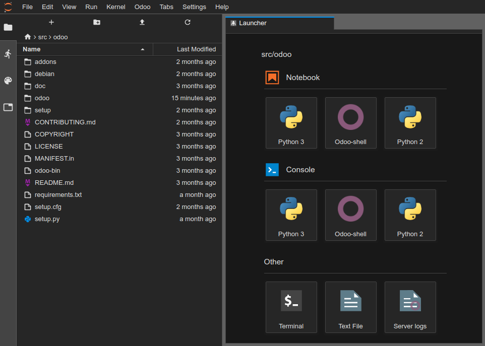
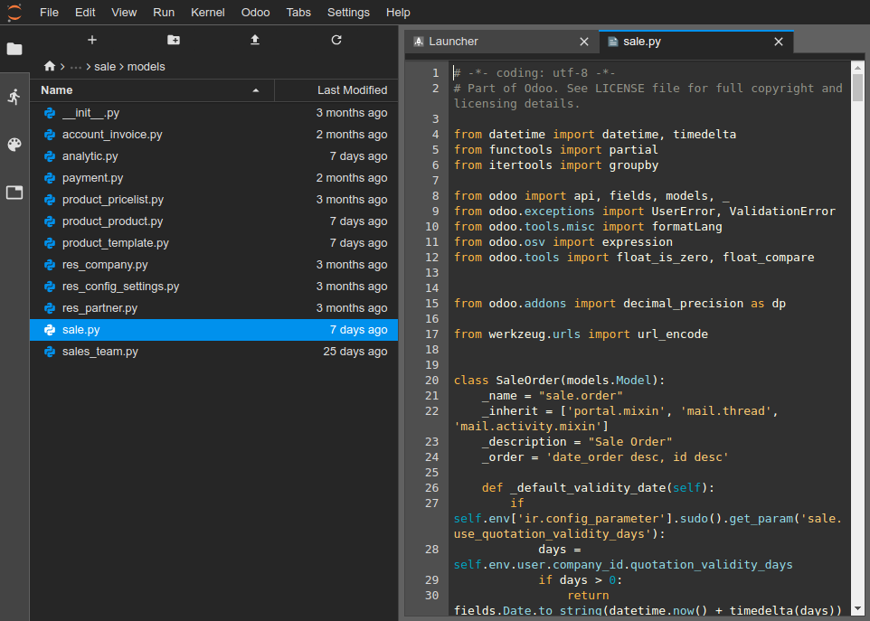
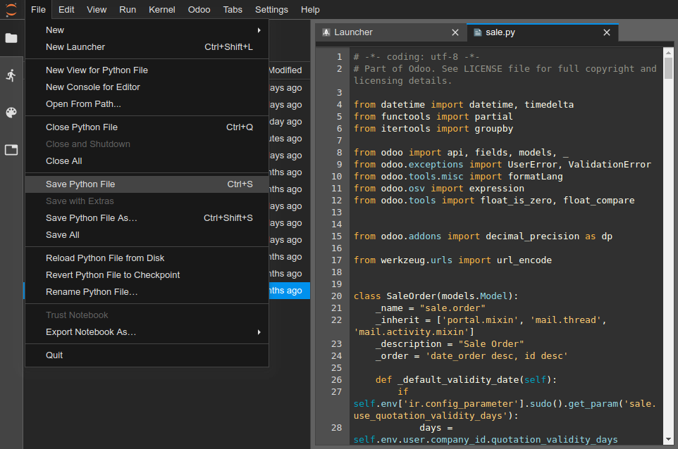

:banner: banners/odoo-sh.jpg

.. _odoosh-gettingstarted-online-editor:

==================================
Online Editor
==================================

Overview
========

The online editor allows you to edit the source code of your builds from a web browser.
It also gives you the possibility to open terminals, Python shells, Odoo Shells and
`Notebooks <https://jupyterlab.readthedocs.io/en/stable/user/notebook.html>`_.

You can access the editor of a build through
:ref:`the branches tabs <odoosh-gettingstarted-branches-tabs>`,
:ref:`the builds dropdown menu <odoosh-gettingstarted-builds-dropdown-menu>`
or by adding */odoo-sh/editor* to your build domain name
(e.g. *https://odoo-addons-master-1.dev.odoo.com/odoo-sh/editor*).

Edit a file
===========

The working directory is composed of the following folders:

::

  .
  ├── home
  │    └── odoo
  │         ├── src
  │         │    ├── odoo                Odoo Community source code
  │         │    │    └── odoo-bin       Odoo server executable
  │         │    ├── enterprise          Odoo Enterprise source code
  │         │    ├── themes              Odoo Themes source code
  │         │    └── user                Your repository branch source code
  │         ├── repositories             The Git repositories used by your project
  │         ├── data
  │         │    ├── filestore           database attachments, as well as the files of binary fields
  │         │    └── sessions            visitors and users sessions
  │         └── logs
  │              ├── install.log         Database installation logs
  │              ├── odoo.log            Running server logs
  │              ├── update.log          Database updates logs
  │              └── pip.log             Python packages installation logs

You can edit the source code (files under */src*) in development and staging builds.
For production builds, the source code is read-only, because applying local changes on a production
server is not a good practice.

* The source code of your Github repository is located under */src/user*,
* The source code of Odoo is located under */src/odoo* (`odoo/odoo <https://github.com/odoo/odoo>`_),
  */src/enterprise* (`odoo/enterprise <https://github.com/odoo/enterprise>`_),
  */src/themes* (`odoo/design-themes <https://github.com/odoo/design-themes>`_).

To open a file in the editor, just double-click on it in the file explorer panel on the left.

You can then begin to make your changes. You can save your changes with the menu
:menuselection:`File --> Save .. File` or by hitting the :kbd:`Ctrl+S` shortcut.

If you save a Python file which is under your Odoo server addons path,
Odoo will detect it and reload automatically so your changes are reflected immediately,
without having to restart the server manually.
